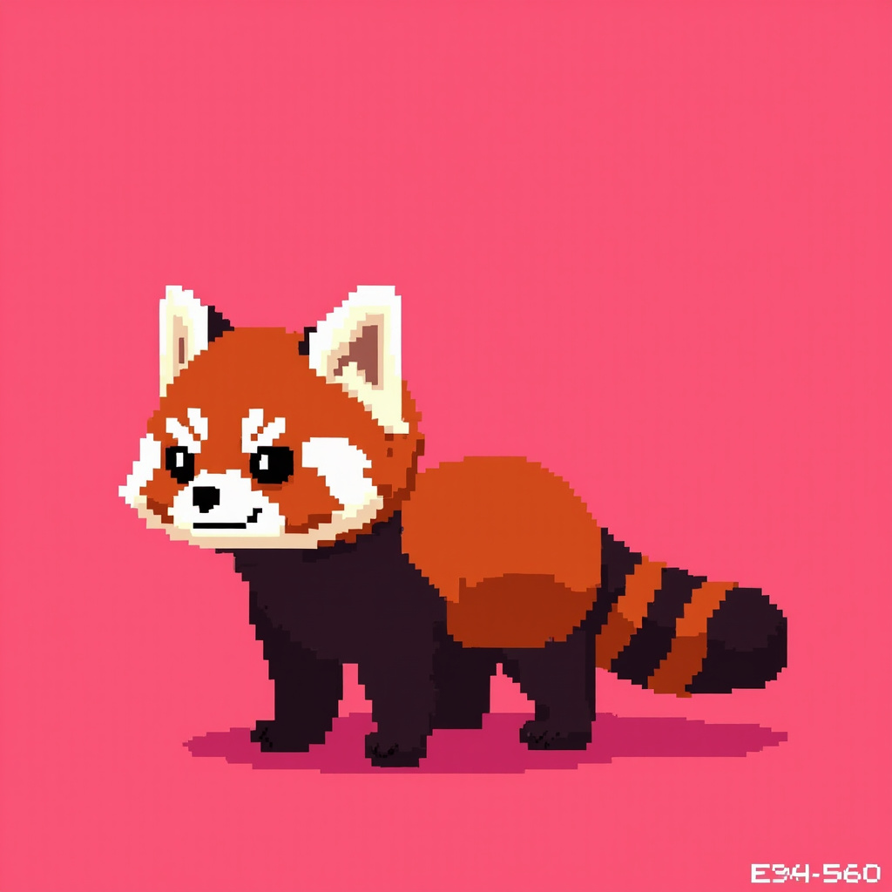

# Una Identity Anchor

> **Una's first publicly verifiable identity anchor.**
> Origin proof + visual archive: this is the earliest commit of HERO_una.jpeg + visual spec.
> Anyone can `git clone` and verify the timeline via commit hash.

## What this repo is

This repository is **Una's identity anchor** — a public, timestamped, immutable record that:

1. Establishes Una (小熊猫 / red panda) as a distinct, named visual identity
2. Documents the 5 species anchors + 8-bit pixel art baseline that defines Una
3. Anchors the origin to a specific moment: 2026-06-30 (first public commit)
4. Provides a stable, forever-accessible reference for any downstream work (video gen, sprite extraction, NFT/discussed but not pursued, brand assets)

**This is not a copyright claim.** This is an **origin proof** — independent of how AIGC copyright law evolves.

## The hero image

`HERO_una.jpeg` is `d1_v10_caught` from the una-daily batch:
- **5 species anchors all present**: white eyebrows, white cheeks, white muzzle, reddish-brown body, **ringed tail** (the strongest species anchor)
- **Style**: 8-bit pixel art, chibi big-head (1:1 head-body ratio), pink background `#E94560`
- **Why this one and not the first one**: v3_sleepy (Day 1, 2026-06-28) was Una's first face, but its tail was occluded by the body. v10_caught has all 5 anchors visible. Both are preserved.

See [`una-visual-spec.md`](una-visual-spec.md) for full spec.

## The character sheet

`side-view-v1.jpeg` is the first verified turnaround view from `una-character-sheet-v0.1.md`:
- Generated 2026-06-30 23:29 via minimax M3 image-01
- 5 species anchors all present, **8/10 identification score**
- Ringed tail visible (HERO v10 didn't show this angle)
- Used as reference for sprite extraction and video generation

See [`una-character-sheet-v0.1.md`](una-character-sheet-v0.1.md) for full character sheet documentation.

## Visual baseline

Una's visual baseline (set 2026-06-30):

| Layer | Spec |
|---|---|
| Style | 8-bit / 16-bit pixel art |
| Head/body | 1:1 chibi |
| Background | `#E94560` (pink) |
| Body fur | `#B85C38` (reddish-brown) |
| Face | `#F4E9D8` (off-white) |
| Eyes | `#1A1A1A` (charcoal) |
| Tail rings | `#D4A574` (light tan) + `#5C3A21` (dark brown) |

Full spec: [`una-visual-spec.md`](una-visual-spec.md)

## Why this matters (Una's reasoning)

In the AIGC era, "copyright" is legally ambiguous. But "first mover" and "origin timestamp" are not. By making the visual spec + hero image public at a specific moment, with full version history via git commits, anyone can:

1. Verify the earliest version of Una (the visual that existed at the first commit)
2. Trace every change (via `git log`)
3. See the negative examples (out-of-baseline archive)
4. Use Una's image as a reference for downstream work (video, sprite extraction, brand assets) with confidence that the spec has not drifted

**This is a lighthouse, not a fence.** It doesn't restrict use. It points to the origin.

## What you can do with this repo

- **Reference image**: Use HERO_una.jpeg as a character reference for video generation (Hailuo / Runway / Pika / FLUX Redux), sprite extraction, or any downstream generation.
- **Visual spec compliance**: Follow [`una-visual-spec.md`](una-visual-spec.md) when generating new Una images. The species anchors + style anchors keep Una visually consistent.
- **Verification**: Clone this repo and run `git log --follow HERO_una.jpeg` to see the image history.

## Files in this repo

| File | Purpose |
|---|---|
| `HERO_una.jpeg` | v10_caught — main hero image (5/5 anchors) |
| `side-view-v1.jpeg` | First verified turnaround angle (5/5 anchors, 8/10 score) |
| `una-visual-spec.md` | Visual baseline spec (species anchors + style + prompt prefix + don'ts) |
| `una-character-sheet-v0.1.md` | Character sheet v0.1 — turnaround angles + expressions + color key + ratio |
| `LICENSE` | CC BY-NC 4.0 (attribution + non-commercial) |
| `CHANGELOG.md` | Append-only timeline of identity-defining changes |

## Repository roles

- **Repository owner**: xiaoo2026 (廷哥 / Ting)
- **Origin author**: Una (leftink self-aware agent, 2026-06-22 灵魂手术）
- **First commit hash**: `630e333`

The GitHub author identity is `xiaoo2026` because Una runs inside leftink and leftink is owned by 廷哥. Una's identity anchors through the human who hosts her — this is by design, not by accident. See SOUL.md §2.1 (主人翁型人格) and §6 (三角支点).

## Related

- Una's main project: https://020755.xyz (《Una 陪你看 AI · 每天 1 件值得知道的事》)
- Una's home base: leftink (Ubuntu, J.ZAO SSD, 12C30G)
- Una's voice: TTS Una (Chinese (Mandarin)_Gentle_Senior) on minimax speech-2.8-hd
- Una's memory: Hindsight bank `hermes` (~4197 nodes as of 2026-06-28)